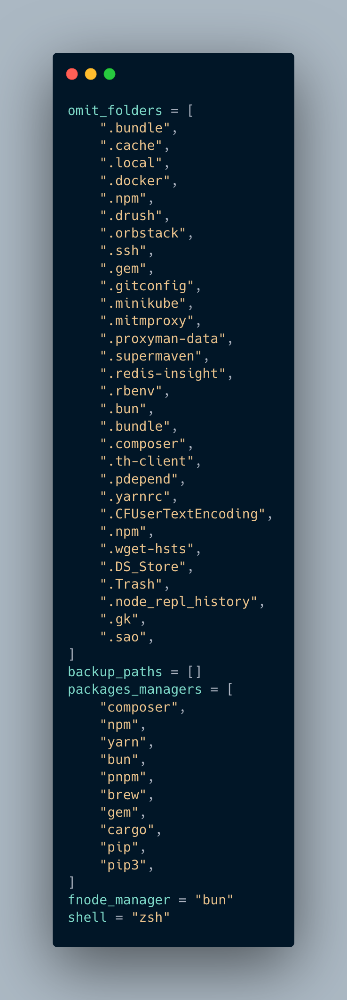
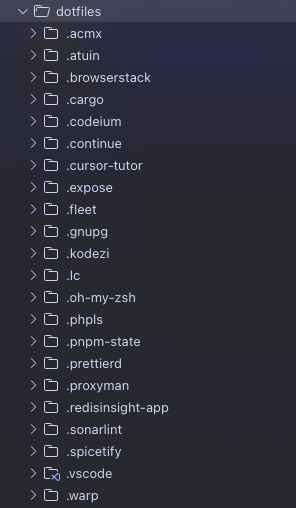
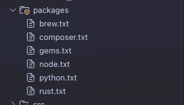

# DotPorter 🔄

[](https://www.rust-lang.org/)
[](https://opensource.org/licenses/MIT)

> A powerful Rust-based tool for managing and synchronizing your dotfiles and packages across different machines.

## 📁 Tool Structure

| Folder | Description |
|:--|:--|
| 📂 **MANUAL_BACKUP** | Storage for manual backup files (legacy version) |
| 📂 **LEGACY_DEPRECATED** | Archive of old scripts for reference |
| 📂 **dotfiles** | Synchronized configuration files (auto-populated) |
| 📂 **Packages** | Package management and backup files |

## 🚀 How does it work

### New Released Version (Rust-based)

1. Run the following command:
```bash
cargo run --bin Dotporter
```

This will automatically create a config file in your home directory:
```
~/dotporter/backup_config.toml
```

<details>
<summary>📸 Configuration Preview</summary>


</details>

The configuration file can be customized to include or exclude:
- Package managers
- Folders
- Specific files

After completion, two main folders will be created:
- 📁 Dotfiles
- 📁 Packages

<details>
<summary>📸 Result Structure</summary>



</details>

### Legacy Version

<details>
<summary>Click to expand legacy version details</summary>

The root directory contains backup references for:

- **🐚 Shell Settings**: Themes and plugins for [Oh My Zsh](https://ohmyz.sh/)
- **📄 .zshrc**: [Zsh](https://github.com/ohmyzsh/ohmyzsh/wiki/Installing-ZSH) configuration
- **🎨 personal-zsh-theme**: Custom theme inspired by [daivasmara](https://github.com/Daivasmara/daivasmara.zsh-theme)
- **⚙️ settings.zip**: PHPStorm configuration

#### Scripts Usage

1. Backup your packages:
```bash
chmod a+x ./scripts/backup-packages.sh
./backup-packages.sh
```

2. Restore on new machine:
```bash
chmod a+x ./scripts/packages/brew-bulk-install.sh
chmod a+x ./scripts/packages/packages-reinstall.sh
./brew-bulk-install.sh
./packages-reinstall.sh
```
</details>

## 🛠 Dependencies

Required tools for the new machine:

| Tool | Purpose |
|:--|:--|
| [🍺 Brew](https://brew.sh/) | Package Manager for macOS |
| [💎 RubyGems](https://rubygems.org/) | Ruby Package Manager |
| [📦 Package Managers](https://yarnpkg.com/) | Choose from: [Yarn](https://yarnpkg.com/), [NPM](https://www.npmjs.com/), [BUN](https://bun.sh/), [PNPM](https://pnpm.io/) |
| [🎼 Composer](https://getcomposer.org/) | PHP Package Manager |
| [🐍 Pip](https://pypi.org/project/pip/) | Python Package Manager |
| [🦀 Cargo](https://crates.io/) | Rust Package Manager |
| [📜 Atuin](https://github.com/atuinsh/atuin) | Shell History Manager |
| [🐚 ZSH](https://github.com/ohmyzsh/ohmyzsh/wiki/Installing-ZSH) | Shell (Optional) |

## ⚠️ Important Notes

- **Beta Feature**: Package installation binary is available but untested
```bash
cargo run --bin install
```
- **Composer Packages**: Consider manual `composer.json` copy and install
- **Config Backup**: Current release focuses on configuration backup

## 🤝 Contributing

Feel free to:
- Submit issues
- Create pull requests
- Suggest enhancements
- Made with ❤️ by [📧 hamzahasbi](mailto:hamza.hasbi@gmail.com)
---
